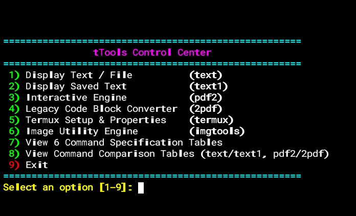

<h1>t-Tools :- Terminal/Termux Tools</h1>

A powerful suite of interactive CLI utilities for Termux to render ANSI text banners, compile Markdown/code to PDF, manipulate images, and streamline system management.

<h3>Packages Required:-</h3>

<ol>
<h2>Termux pkg's:-</h2>
  <li><strong>figlet</strong></li>
  <li><strong>git</strong></li>
  <li><strong>pandoc</strong></li>
  <li><strong>typst</strong></li>
  <li><strong>pv</strong></li>
  <li><strong>libxslt</strong></li>
  <li><strong>xsltproc</strong></li>
  <li><strong>python</strong></li>
  <li><strong>libcairo</strong></li>
  <li><strong>nano</strong></li>
  <li><strong>imagemagick</strong></li>
  <h3>PIP pkg's:-</h3>
  <li><strong>weasyprint</strong></li>
</ol>

<h2>Available Command's:-</h2>

<table width="100%" height="300px" border="3">
  <thead>
    <tr>
      <th align="left">Command</th>
      <th align="left">Category</th>
      <th align="left">Description</th>
    </tr>
  </thead>
  

  <tbody>
    <tr>
      <td><code>tTools</code></td>
      <td>Control Center</td>
      <td>Interactive central dashboard to launch utilities and view specs.</td>
    </tr>
    <tr>
      <td><code>text</code></td>
      <td>Banner Engine</td>
      <td>Generates large Red ANSI FIGlet text banners from input or files.</td>
    </tr>
    <tr>
      <td><code>text1</code></td>
      <td>Banner Engine</td>
      <td>Generates compact Cyan ANSI FIGlet text banners.</td>
    </tr>
    <tr>
      <td><code>pdf2</code></td>
      <td>PDF Engine</td>
      <td>Renders HTML, XML, and ANSI terminal output to PDF via WeasyPrint.</td>
    </tr>
    <tr>
      <td><code>2pdf</code></td>
      <td>PDF Exporter</td>
      <td>Compiles code blocks and Markdown documents to PDF using Pandoc & Typst.</td>
    </tr>
    <tr>
      <td><code>imgtools</code></td>
      <td>Image Engine</td>
      <td>Converts, resizes, compresses, rotates images, or merges them into an A4 PDF.</td>
    </tr>
    <tr>
      <td><code>termux</code></td>
      <td>System Tool</td>
      <td>Quick package manager updater and <code>termux.properties</code> manager.</td>
    </tr>
  </tbody>
  

</table>

<h2>Feature's:-</h2>

<table width="100%">
  <thead>
    <tr>
      <th align="left">Feature</th>
      <th align="left">Description</th>
    </tr>
  </thead>
  <tbody>
    <tr>
      <td><b>📂 Interactive Storage Browser</b></td>
      <td>Navigate and select files directly from internal storage (<code>/storage/emulated/0</code>) or Termux Home (<code>$HOME</code>).</td>
    </tr>
    <tr>
      <td><b>📄 Document & Code Exporter</b></td>
      <td>Compile raw source code, Markdown, HTML, XML, and ANSI terminal output into custom styled PDFs using Pandoc, Typst, and WeasyPrint.</td>
    </tr>
    <tr>
      <td><b>🖼️ Image Processing Suite</b></td>
      <td>Convert formats, resize, compress, rotate images, and merge multiple pictures into a single A4 PDF document.</td>
    </tr>
    <tr>
      <td><b>🎨 Custom ANSI Banners</b></td>
      <td>Generate high-impact ANSI FIGlet text banners with custom colors and kerning options.</td>
    </tr>
    <tr>
      <td><b>🎛️ Central Control Hub</b></td>
      <td>Launch scripts, inspect dependencies, and view tool specs instantly through a unified interactive menu (<code>tTools</code>).</td>
    </tr>
    <tr>
      <td><b>⚙️ System Optimization</b></td>
      <td>Automate package updates and easily modify <code>termux.properties</code> configurations.</td>
    </tr>
  </tbody>
</table>

<h2>Setup:-<h2>

<table width="100%" border="2">
  <thead>
    <tr>
      <th align="center">Step</th>
      <th align="left">Action</th>
      <th align="left">Command / Link</th>
    </tr>
  </thead>
  <tbody>
    <tr>
      <td align="center">1</td>
      <td><b>Download Link</b></td>
      <td><code>https://github.com/The-Learner-X/t-Tools.git</code></td>
    </tr>
    <tr>
      <td align="center">2</td>
      <td><b>Change Directory</b></td>
      <td><code>cd t-Tools</code></td>
    </tr>
    <tr>
      <td align="center">3</td>
      <td><b>Run Setup Script</b></td>
      <td><code>bash setup.sh</code></td>
    </tr>
    <tr>
      <td align="center">4</td>
      <td><b>Run Tool</b></td>
      <td><code>tTools</code></td>
    </tr>
  </tbody>
</table>

# t-Tools # termux # Linux
